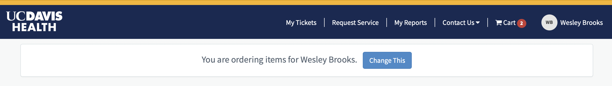
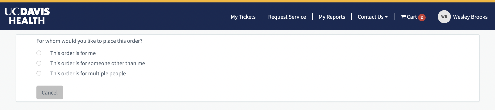
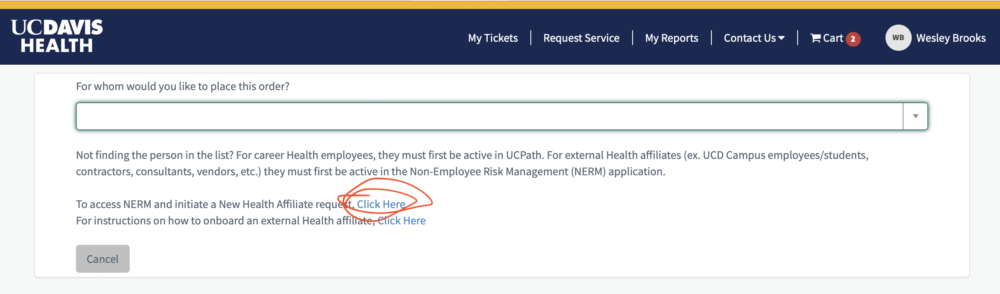
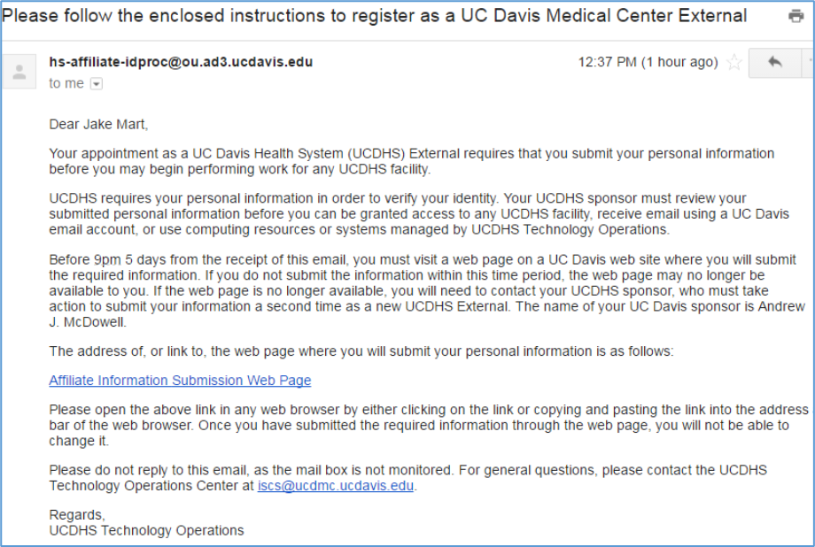
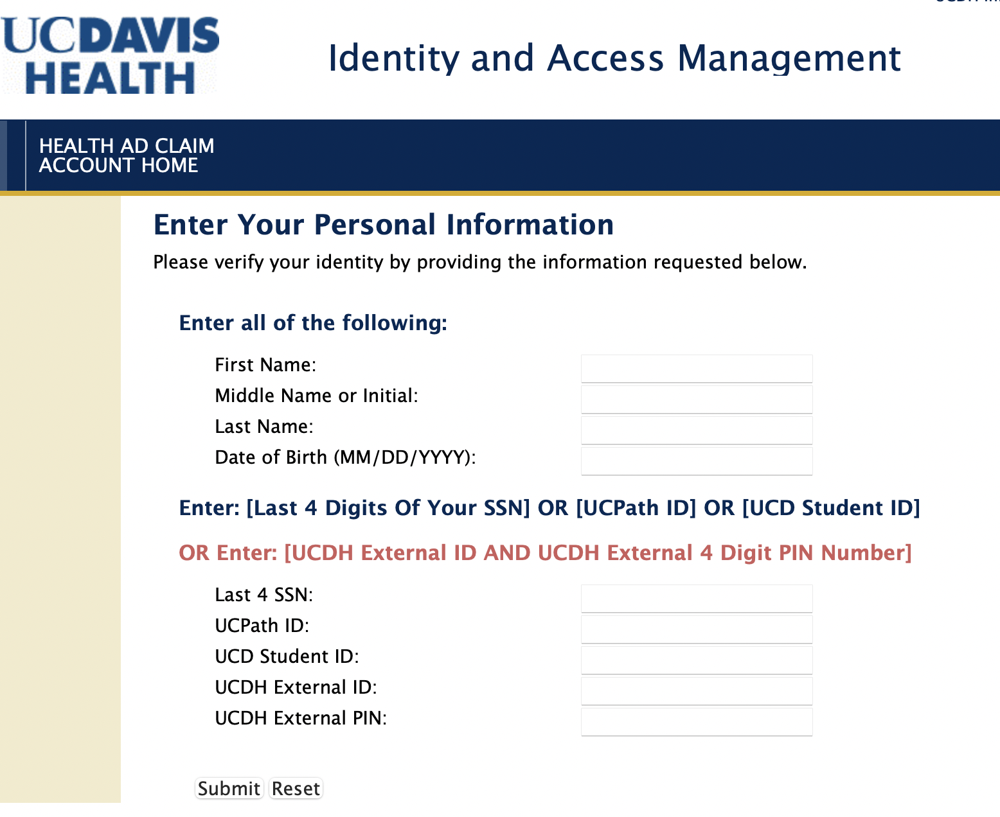

(appendix:order-external-affiliate)=
# Creating an External Affiliate

As mentioned in {ref}`chapter:active-directory`, someone else with advanced rights in the UCDH It system must order external affiliate status for you using the Service Now catalog. This section describes how they should do that.

The person requesting your external affiliate status (hereafter called "requestor") does not order "Add an External Affiliate" directly from the Service Now catalog. Instead they will place an order on your behalf for something like access to the UCDH Virtual Private Network (VPN, see {ref}`vpn`), and then at the checkout page they must make sure to order the service for you by clicking "Change This" next to the header that says, "You are ordering items for [yourself]," then "This order is for someone other than me." See screenshots below to recognize the header. 

This will allow them to open the (Non-Employee Risk Management portal)[https://ucdavis-prod.nonemployee.com/neprofile_dashboard/] (NERM), which is where they will actually request an affiliate account and provide all your personal information. For details of how to fill out the NERM request, [see this knowledge base article](https://ucdh.service-now.com/itss?sys_kb_id=b233d4161bfd5d501c9e4223cd4bcba5&id=kb_article_view&sysparm_rank=1&sysparm_tsqueryId=e411213e2b1cb254397ff933c891bfab). However, the article is not quite accurate in how it describes details of changing who the order is for, so I [Wes] am not certain that it accurately describes how to use NERM to request an external affiliate account.

Once your requestor enters your identifying information, the NERM system will generate an email to you (an example is shown in the screenshot below.)

Following the link in the email will bring you to a form like the following that requests you to enter identifying information and indicate whether you are a UC Davis student or employee. Once you submit your information, your requestor will get an email prompting them to review and approve the information you entered. Once they submit that approval, UCDH IT will proceed with creating your affiliate account.

## Claiming Your Account
Once you are an affiliate and an AD account has been created on your behalf, you must claim it by providing some personal details that match the official UCDH records. [Follow this link to claim your account](https://hsiam.ucdavis.edu/selfservice/claimaccount). The link takes you to an information page with a link to proceed. Click that link and you'll land at the following screen:

You'll confirm your identity by entering your full name and date of birth, as well as one of the following:

- Last four digits of your social security number
- Your UCPath ID number
- Your UC Davis student ID number
- The combination of an ID and PIN for external affiliates
